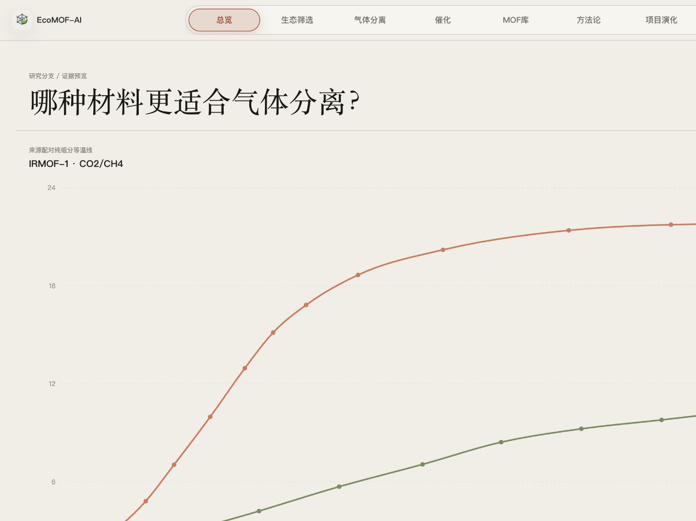
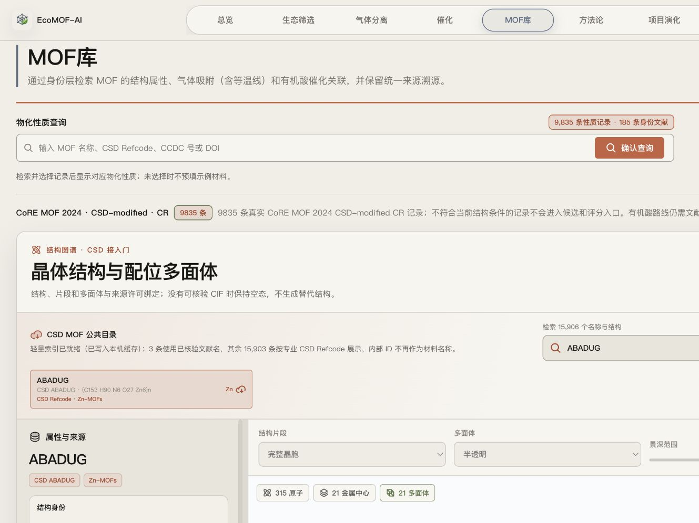
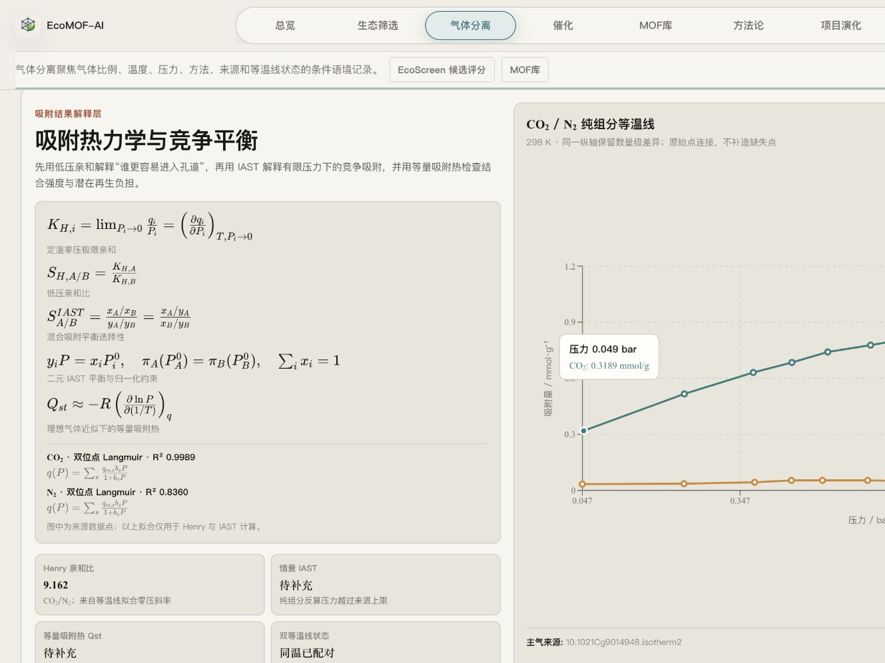
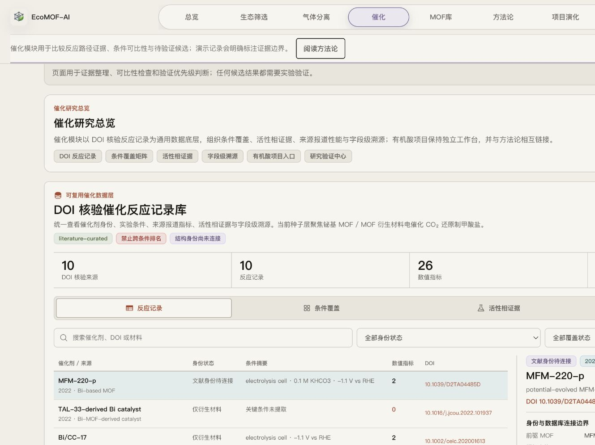
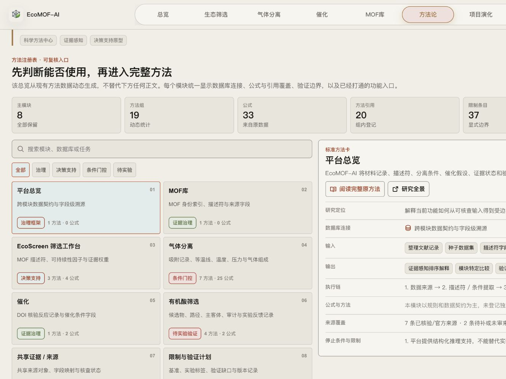

# 知乎发布稿

## 推荐标题

**做 MOF 筛选时，我们缺的不是另一个分数，而是一条可追溯的证据链**

备选标题：

1. 我把 MOF 筛选、气体分离、催化证据和方法论做成了一个可交互 Web
2. 我做了一个 MOF 研究 Web：每个排名都必须回答“证据从哪里来”
3. 从气体分离到催化证据：我为什么把 MOF 研究做成一个可追溯 Web

## 推荐摘要

EcoMOF-AI 不是一个输入材料名称、输出单一分数的黑箱工具。它尝试把 MOF 结构身份、数据来源、任务条件、计算方法、证据等级、缺失字段和验证路线放在同一条可检查的研究链上。本文介绍我为什么做这个 Web，以及它目前在可持续筛选、气体分离、催化证据和方法论治理方面能够做什么、不能做什么。

---

# 做 MOF 筛选时，我们缺的不是另一个分数，而是一条可追溯的证据链

最近，我把持续整理的 MOF 研究工作做成了一个可以直接访问的 Web：**EcoMOF-AI**。

网站地址：https://linus-he.github.io/ecomof-ai/

GitHub：https://github.com/Linus-He/ecomof-ai

我最初想解决的并不是“怎样再做一个材料排行榜”，而是另一个更基础的问题：

当一个系统告诉我们“这个 MOF 值得优先研究”时，它能不能继续回答下面这些问题？

- 结构和性质数据从哪里来？
- 两条记录是否处在相同温度、压力、气体组成和实验条件下？
- 当前数值是文献直接报道、重新计算，还是只能作为代理指标？
- 哪些字段缺失，哪些结论因此不能继续向前推？
- 下一步究竟应该补数据、做实验，还是停止比较？

如果这些问题无法回答，那么再精确的分数也很难真正进入研究决策。

所以我更愿意把 EcoMOF-AI 称为一个**证据感知的 MOF 研究工作台**，而不是黑箱排名器。

*图 1：从可持续性、结构来源、气体分离、催化路径到可信验证，首页以研究问题组织入口。*

## 1. 从“材料名称”开始的，不应该只是一个不透明编号

MOF 数据经常同时出现在结构数据库、性质数据集、吸附数据库和论文中，但不同来源对材料名称、结构标识、实验条件和许可范围的处理并不一致。

EcoMOF-AI 的 MOF 库把“身份连接”放在了性质查询之前。当前页面可检索 9,835 条 CoRE MOF 2024 CSD-modified CR 结构记录，并保留独立的身份文献入口。结构、片段、多面体和性质字段都会尽量指回自己的来源；没有可核验 CIF 时，界面会保留空态，而不是生成一个看起来合理的替代结构。

*图 2：MOF 库同时呈现结构身份、检索入口、数据规模与来源边界。*

这看起来比“直接显示一个漂亮的三维结构”更克制，但对研究而言，知道**什么不能显示、为什么不能显示**，和看到结果本身同样重要。

## 2. 气体分离不能只比较一个选择性数值

在气体分离中，同一个材料的表现会随温度、压力区间、进料组成、等温线模型和评价方法发生变化。把不同条件下的数值放进同一个排行榜，往往会制造并不存在的可比性。

GasSep 工作区因此把场景构建放在前面：先选择气体对、温度、吸附与脱附压力、进料比例和排序方法，再联动查看双组分纯气等温线、Henry 亲和、IAST、工作容量、可再生性和证据等级。

*图 3：同一页面并列展示热力学公式、纯组分等温线、拟合状态和可计算边界。*

这里有一个我刻意保留的原则：**算不出来时就显示“待补充”，而不是用另一个指标假装回答。**

例如，来源报道的选择性、重新计算的 IAST、吸附量比值代理和预测结果会被明确区分；缺少同温配对等温线或超出压力范围时，系统不会把结果包装成可靠的混合吸附结论。

## 3. 催化部分，DOI 不是装饰链接

催化数据比单纯的材料性质更依赖条件。催化剂身份、前驱体、反应器、电解液、电位、负载量、产物定量方式和真实活性相，只要缺少其中几项，跨论文比较就可能失去意义。

目前的催化种子层聚焦铋基 MOF / MOF 衍生材料电催化 CO₂ 还原制甲酸盐，整理了 10 个 DOI 核验来源、10 条反应记录和 26 个数值指标。

*图 4：催化记录库把实验条件、身份连接、数值指标、活性相证据和 DOI 放在同一视图中。*

这个模块不会直接给出跨条件“最优催化剂”。相反，它会明确显示哪些结构身份尚未连接、哪些材料只是衍生相、哪些关键字段没有从可核验来源中提取，以及为什么当前记录不具备同条件排名资格。

我希望它首先是一个研究整理与验证优先级工具，其次才是可视化工具。

## 4. 可持续性不是给材料贴一个“绿色分数”

EcoScreen 从功能单位和系统边界开始，逐步组织清单情景、环境影响、生产成本、不确定性与数据门控。

当前实现是参照 ISO 14040/14044 结构组织的筛选级情景模型，并不是经过同行评审或第三方审查的完整 LCA/TEA。当候选材料缺少真实合成清单时，页面只允许把结果标记为“情景估算”，不能把它当作最终环境排名。

这部分的目标不是替研究者宣布“哪个材料最绿色”，而是让环境负担、经济代价、任务性能和证据缺口可以在同一个决策边界内讨论。

## 5. 方法论不应该藏在页脚的一段说明里

我把方法论做成了网站的一级工作区，而不是一份只在发布前补写的文档。

当前方法注册表动态汇总 8 个主模块、19 个方法组、33 个公式、20 条方法引用和 37 条显式限制。每张方法卡都尽量回答：数据库连接是什么、输入和输出是什么、执行链怎样运行、采用了哪些公式、来源覆盖到哪里、停止条件是什么，以及可以跳转到哪个实际功能。

*图 5：方法注册表先呈现适用边界，再连接到完整方法、公式、来源与实际工作区。*

我认为这比单纯展示“模型效果很好”更重要。研究工具真正需要建立的，不只是结果的可读性，还有结果的**可复核性**。

## 6. 它目前能做什么，又不能做什么？

EcoMOF-AI 目前适合用于：

- 整理跨数据库、跨文献的 MOF 结构与性质证据；
- 在明确任务条件下比较气体分离候选；
- 查看公式、字段来源、证据等级和缺失状态；
- 组织催化反应记录、条件覆盖与活性相证据；
- 把下一步的数据补全或实验验证转化为明确任务。

它不能替代：

- 实验室验证；
- 完整、经审查的 LCA/TEA；
- 对跨条件文献结果的直接排名；
- 从相关性或界面评分自动推导因果结论；
- 在缺少结构身份和来源授权时生成“看起来合理”的确定答案。

这些限制不是附注，而是产品本身的一部分。

## 7. 为什么现在把它公开？

我并不认为这个 Web 已经给出了 MOF 研究的“最终答案”。相反，我希望它把研究过程中最容易被省略的部分公开出来：数据从哪里来、条件是否可比、公式什么时候成立、缺失值会阻断什么、以及下一次验证应该做什么。

如果你从事 MOF、吸附分离、催化、LCA、材料数据库或科研软件相关工作，欢迎直接试用，也欢迎指出：

- 数据来源或 DOI 是否存在错误；
- 哪些任务条件仍然缺失；
- 哪个公式或证据边界表达得不够准确；
- 哪些交互影响了科研阅读效率；
- 哪个模块值得优先继续完善。

网站：https://linus-he.github.io/ecomof-ai/

项目仓库：https://github.com/Linus-He/ecomof-ai

**Keep testing. 不是让系统替研究者下结论，而是让每一个结论都能继续被检查。**

---

## 图片发布顺序

1. 封面：`00-zhihu-cover-1200x675.png`
2. 图 1：首页研究分支：`02-home-research-atlas.png`
3. 图 2：MOF 库：`07-mof-library.png`
4. 图 3：气体分离热力学：`04-gassep-thermodynamics.png`
5. 图 4：催化 DOI 记录库：`05-catalysis-doi-records.png`
6. 图 5：方法论注册表：`06-methodology-evidence-chain.png`

备用图片：

- 气体分离场景构建器：`03-gassep-scenario.png`
- EcoScreen：`08-ecoscreen.png`
- 首页完整首屏：`01-cover-home.png`

## 推荐话题

MOF、材料科学、科研工具、AI for Science、数据可视化、化学、科研方法
